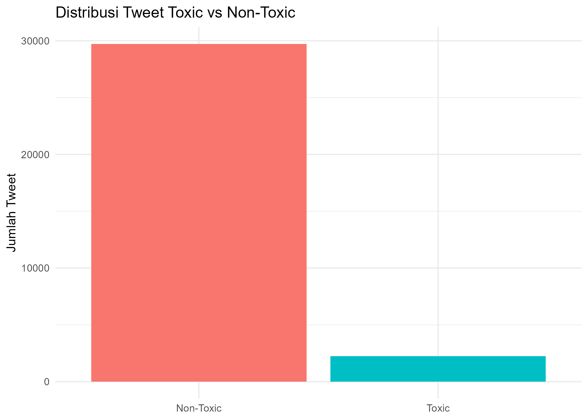
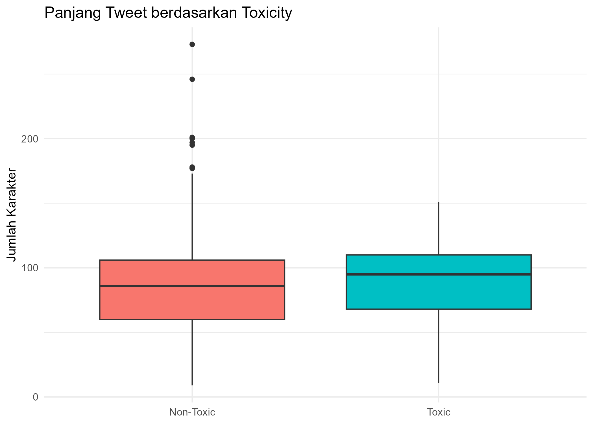
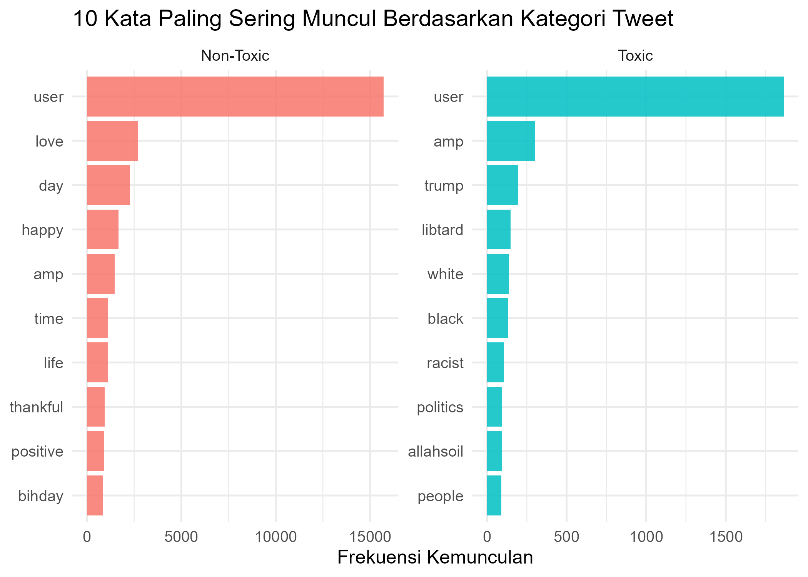

# Twitter-Toxicity-Text-Analysis

## Deskripsi Singkat

Proyek ini bertujuan untuk menganalisis teks tweet dan mengidentifikasi perbedaan karakteristik antara tweet toxic dan non-toxic menggunakan
pendekatan text mining dan visualisasi data. Analisis dilakukan dengan bahasa pemrograman R melalui tahapan pembersihan teks, tokenisasi, analisis frekuensi kata, 
serta TF-IDF untuk mengidentifikasi kata-kata yang paling khas pada masing-masing kategori.

## Tujuan dari analisis

Tujuan dari proyek ini adalah:
1. Menganalisis distribusi tweet toxic dan non-toxic
2. Membandingkan panjang tweet berdasarkan tingkat toxicity
3. Mengidentifikasi kata-kata yang paling sering muncul secara global
4. Mengidentifikasi kata khas pada tweet toxic dan non-toxic
5. Menyediakan insight awal untuk pengembangan model klasifikasi teks

## Dataset

Dataset yang digunakan berasal dari Kaggle dan berisi sekitar 31.962 tweet.
Struktur data:
- `id`    : ID unik tweet
- `label` : Kategori tweet (toxic / non-toxic)
- `tweet` : Teks tweet

## Visualisasi

### Proporsi Tweet Toxic vs Non-Toxic

### Panjang Tweet Toxic vs Non-Toxic

### 15 Kata Paling Sering Muncul

### Top Tweet Toxic vs Non-Toxic

