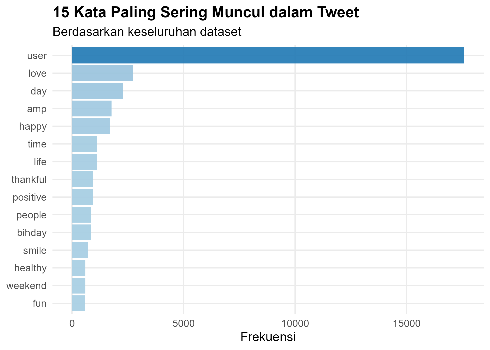

# Twitter-Toxicity-Text-Analysis

## Deskripsi Singkat

Proyek ini bertujuan untuk menganalisis tingkat toksisitas pada tweet menggunakan pendekatan text mining.
Analisis dilakukan untuk memahami karakteristik tweet toxic dan non-toxic berdasarkan frekuensi kata, panjang tweet, dan distribusi label.

## Tujuan dari analisis

- Mengidentifikasi perbedaan karakteristik antara tweet toxic dan non-toxic
- Mengetahui kata-kata yang paling sering muncul dalam dataset tweet
- Memberikan gambaran awal terkait pola bahasa pada konten toxic di Twitter

## Dataset

Dataset yang digunakan berasal dari Kaggle dan berisi sekitar 31.962 tweet.
Struktur data:
- `id`    : ID unik tweet
- `label` : Kategori tweet (toxic / non-toxic)
- `tweet` : Teks tweet

## Visualisasi

### Proporsi Tweet Toxic vs Non-Toxic

### Panjang Tweet Toxic vs Non-Toxic

### 15 Kata Paling Sering Muncul

### Top Tweet Toxic vs Non-Toxic

